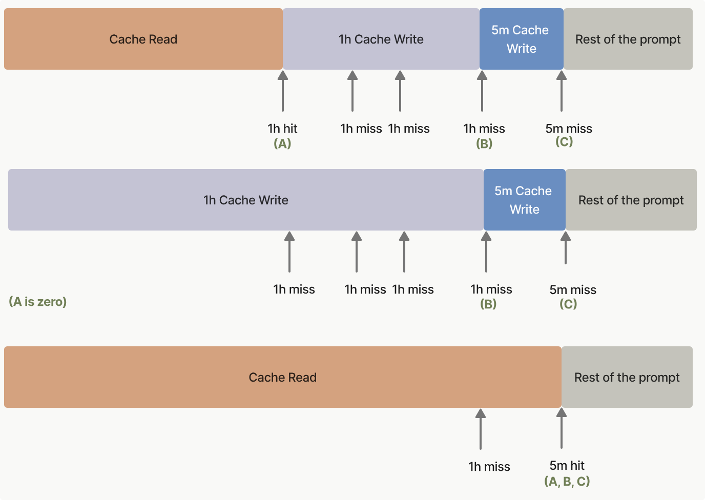
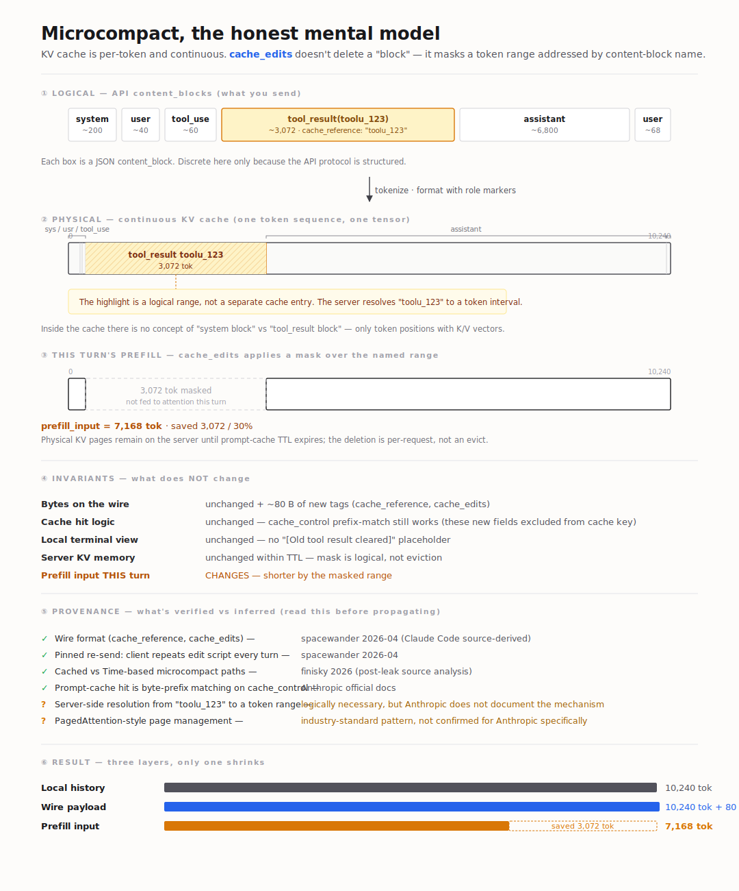
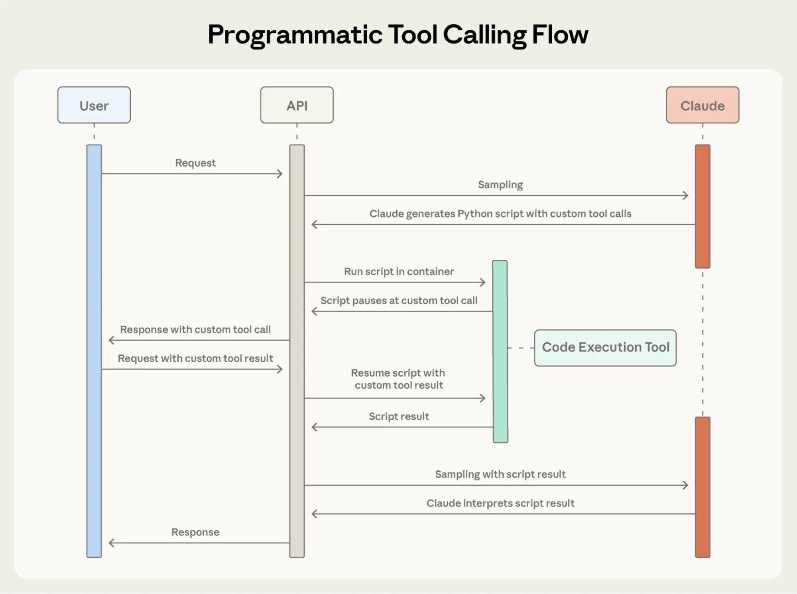

# Anthropic 2026 Context Engineering 四件套：Compact / Cache / Tools / Skill


## TL;DR

Context engineering 的全景由两类 4 件原语构成——

**横切机制**（作用于一切已经投影到 window 上的内容）：

- **Cache**——复用 prefix 跳过 prefill；省钱省 TTFT，**不**减 token
- **Compaction**——把 messages 真的变短；突破窗口上限

**对象侧投影**（控制特定对象如何进入 window）：

- **Tool 三件套**（Tool Search / PTC / Examples）——管工具的 *定义 / 结果 / 用法* 三种 context 投影
- **Skill**——管指令/playbook 的渐进披露（与 Tool Search Tool 同构，作用面换成指令）

四者**正交、可叠加**。原则是"看瓶颈点菜"——每加一件都有 overhead。

---

## 1. 全景：四件套如何分工

| 原语 | 作用对象 | 在 context 上做什么 | 何时引入 |
|---|---|---|---|
| **Cache** | 任何 prefix | 跳过 prefill；不减 token | prefix 重复，且 ≥ 1K-4K token |
| **Compaction** | messages / tool result / thinking block | 把 token 砍小，突破窗口上限 | 长会话、tool result 累积 |
| **Tool 三件套** | tool 的 definition / result / 用法 schema | 按需加载、隔离结果、范例校准 | 工具库大、结果数据多、参数复杂 |
| **Skill** | instruction / playbook | 描述常驻、内容按需展开 | 大量复用 prompt 模板 |

**横向接口点**——这些不是巧合，是设计目标：

- Tool Search Tool 与 cache **显式兼容**：deferred 工具不进初始 prompt，cache 不被其增删动到
- Compaction 的 background summarizer **应当与主对话共享 prefix 并打 cache_control**——这才是长会话的标准答案（§4）
- Skill 描述层和 Tool Search Tool 同构：都是"按需加载"思想，只是作用对象不同

---

## 2. Caching：复用 prefix 的三级阶梯

三级共用同一条契约——**下一次请求的 prefix 与某条已存在 cache 条目字节级一致 → 跳过那段 prefill**。每往下一级开发者拿到更多控制权，也承担更多复杂度。



### 2.1 自动 / 显式 / 投机

**自动 cache**（automatic）——顶层一行，breakpoint 系统决定，多轮对话里自动随尾巴往后挪：

```python
client.messages.create(
    model="claude-sonnet-4-6",
    cache_control={"type": "ephemeral"},   # 唯一改动
    messages=[...],
)
```

| 状态 | usage 字段 |
|---|---|
| Baseline | `input_tokens` |
| Cache write | `cache_creation_input_tokens` |
| Cache hit | `cache_read_input_tokens` |

**这个简单性也是上限**：一个 slot、一个 TTL，做不到 system 与对话分开缓存、不同段配不同 TTL。

**显式 cache**（explicit）——把 `cache_control` 挂到 content block 上，单请求最多 4 个 explicit breakpoint（与 automatic 的 1 个 slot 可混用）：

```python
system=[{"type":"text","text":sys,"cache_control":{"type":"ephemeral"}}]
messages=[..., {"role":"user","content":[{
    "type":"text","text":last,"cache_control":{"type":"ephemeral"}
}]}]
```

切换信号：要分 TTL、要独立缓存 system / tool schema、单 prompt 多段大块 context。代价：marker 位置变成你的事——**别一上来就用**。

**投机 cache**（speculative）——前两级要"用户提交"才写 cache。第三级把写 cache 时机抽出来：用户在输入框打字那几秒，后台用 `max_tokens=1` 触发 prefill 把 cache 种好；提交时 cache 已经 hot，TTFT 只剩 query 段那几十 token 的 prefill。

```python
cache_task = asyncio.create_task(sample_one_token(client, [initial_message]))
user_question = await wait_for_user_submit()
await cache_task

cached_message = copy.deepcopy(initial_message)   # ← 命门
cached_message["content"].append({"type":"text","text":f"Answer: {user_question}"})
async with client.messages.stream(messages=[cached_message], ...) as stream: ...
```

`deepcopy` 不是仪式感。Python list 是同对象引用，不复制就 append 会让 warming 写进 cache 的 prefix 与正式请求字节级不一致——cache 100% miss、warming 那笔钱白花。盯 `cache_read_input_tokens` 才看得出来。

**它不省钱**——多了一笔 `0.1× × prefix` 的 read 费用，**只压缩用户感知的 TTFT**。批量调用、prefix 高度动态、prefix 不到最小阈值都不该上。

### 2.2 共用契约与硬数字

| 维度 | 取值 |
|---|---|
| 最小可缓存长度 | 1,024 tokens（Sonnet）；4,096（Opus、Haiku 4.5） |
| Cache write 单价 | 1.25× base input |
| Cache read 单价 | 0.1× base input |
| 默认 TTL | 5 分钟，命中刷新 |
| 1h TTL | write 升至 2× base input |
| 单请求 breakpoint | 4 explicit + 1 automatic slot |

三件**永远不要踩**：

- prefix 短于阈值 → `cache_control` 静默无效（不报错、不缓存）
- prefix 字节级不一致 → 100% miss（timestamp、空白、字段顺序、tool schema 任何变动都归零）
- 5 分钟内不再次命中 → cache 已 evict；多轮间隔可能超 5min 时考虑 1h TTL（写贵 1.6×，命中两三次回本）

### 2.3 timestamp 的双关用法

| 场景 | 解决什么 |
|---|---|
| 重跑 notebook | 避免撞到上次 cache 残留 |
| 多 session 隔离 | 用户 A 的 cache 不该被 B 命中 |

工程反推：

- prefix 是**公共资源**（产品手册、API 文档、开源代码）→ **不要**加 timestamp，让多 session 共享
- prefix 是**用户私有数据** → **必须**加 timestamp 或别的隔离标识

---

## 3. Compaction：真把 context 变短

### 3.1 几种姿势

**传统压缩**（阻塞同步，类似 `/compact`）——撞到上限才触发，主 loop 暂停等 summary。最稳但延迟体感最差。

**实时压缩 / Session Memory**（soft threshold）——到达 soft threshold（不是上限）就在后台异步起 summarizer，生成完替换主对话历史。**用户视角无停顿**，是当前推荐的客户端流派。

**微压缩 / Context Editing**（细粒度清理）——不做大段 summary，只清掉已无用的 block：

| 原语 | 干什么 | 备注 |
|---|---|---|
| `clear_tool_uses_20250919` | 清旧的 tool result | 默认 100K trigger |
| `clear_thinking_20251015` | 清旧的 extended thinking | 需 thinking 启用 |

可配 `trigger`、`keep`（默认保留最近 3 个 tool use）、`exclude_tools`、`clear_tool_inputs`。



> ⚠️ 已知 issue：[claude-code#42542](https://github.com/anthropics/claude-code/issues/42542) — *Silent context degradation: tool results cleared without notification on 1M context sessions*。该 issue 文档了 microcompact / cached microcompact / session memory compact **三个机制可能在用户无感知下丢内容**。1M 上下文场景尤其要警惕。

### 3.2 服务端原语（推荐路径）

把压缩策略**声明给 API**，服务端在 token 达阈值时自动执行——零客户端 loop 代码。

| 原语 | beta header | 关键参数 |
|---|---|---|
| `compact_20260112` | `compact-2026-01-12` | `trigger`（默认 150K，**最少 50K**）、`instructions`、`pause_after_compaction` |
| `clear_tool_uses_20250919` | `context-management-2025-06-27` | `trigger`（默认 100K）、`keep`（默认 3）、`clear_at_least`、`exclude_tools`、`clear_tool_inputs` |
| `memory_20250818` | 独立 | 客户端实现 view / create / str_replace / insert / delete / rename |

**最少 50K** 是硬下限——服务端要保留"还压得动"的余量。

### 3.3 客户端 SDK 压缩（已 deprecated）

`client.beta.messages.tool_runner` 里的 `compaction_control` 已 deprecated。新项目直接走 §3.2 服务端原语。

---

## 4. Cache × Compact：后台 summarizer 共享 prefix

**关键洞察**：后台 summarizer 跑的 prefix，和主对话刚发出去的 prefix 是同一段。给两边都打 `cache_control`，summarizer 享 0.1× 折扣，只为新增的"summarize this"指令付全价。

```python
# 1. 主对话末尾打 marker
{"role":"user","content":[{
    "type":"text","text":msg,"cache_control":{"type":"ephemeral"}
}]}

# 2. summarizer 的 system prompt 也打 marker
system=[{"type":"text",
         "text":"You are a session memory agent...",
         "cache_control":{"type":"ephemeral"}}]
```

省下来的钱（对话越长省得越多）：

```
                 没 caching                + caching                节省
─────────────────────────────────────────────────────────────────────────
Turn 1   ◆        500 @ $3/M  = $0.0015    500 @ $3/M  = $0.0015      -
Turn 2 [...]◆    1500 @ $3/M  = $0.0045    500 read + 1000 new = $0.0032  29%
Turn 3 [.....]◆  3000 @ $3/M  = $0.0090   1500 read + 1500 new = $0.0050  44%
Turn 4 [.......]◆5000 @ $3/M  = $0.0150   3000 read + 2000 new = $0.0069  54%
─────────────────────────────────────────────────────────────────────────
Total           10,000 = $0.0300                        = $0.0166      ~45%
```

后台 summarizer 单次更新成本：

| 模式 | 成本 |
|---|---|
| 无 cache | 5,000 tokens × full price ≈ $0.015 |
| 有 cache | 500 new + 4,500 cache_read ≈ **$0.003（10% of full）** |

需要 compaction 的场景恰恰是长对话——**对话越长，这套组合省得越多**。5min TTL 内连续 update 收益最大；间隔可能超 5min 时考虑 1h TTL。

---

## 5. Tool 三件套：搜索、编排、范例

> 来源：[Anthropic Engineering — Introducing advanced tool use](https://www.anthropic.com/engineering/advanced-tool-use)（2025-11-24）。Beta header `advanced-tool-use-2025-11-20`。

### 5.1 协议层先决：client tool vs server tool

| 维度 | Client Tool（自定义） | Server Tool（Anthropic 托管） |
|---|---|---|
| 谁定义 | 开发者 | Anthropic |
| 谁执行 | 开发者服务端 | Anthropic 基础设施 |
| 协议 block | `tool_use` → `tool_result` | `server_tool_use` → `<name>_tool_result` |
| 轮次 | 完整 round-trip | 单次响应内闭环 |
| 类型名 | 自定义 | 带日期戳：`code_execution_20250825`、`tool_search_tool_regex_20251119` |
| 例子 | `get_expenses`、你写的任何函数 | `code_execution`、`web_search`、`bash`、`text_editor`、`tool_search_tool_*` |

**三件套各自的协议归属**：

| 特性 | 是不是 server tool |
|---|---|
| Tool Search Tool | ✅ 是（`tool_search_tool_regex_20251119`） |
| Programmatic Tool Calling | ✅ 依赖 `code_execution_20250825`（PTC 自身是协议扩展，不是新工具） |
| Tool Use Examples | ❌ 不是（不引入新工具，是 prompt 构造层特性） |

**PTC 的协议反转**：在 PTC 之前，调用方向单向——Claude 发起、client/server 执行、结果回 Claude。PTC 第一次开了反向：**server tool 内部反过来调 client tool**，结果路回 sandbox **不进 model context**。

### 5.2 Tool Search Tool（server tool）

**它本身是 server tool**——搜索发生在 Anthropic 一侧、deferred 工具定义存 server，搜中后才"展开"进 client context。这就是它"不破坏 prompt cache"的协议解释：定义没进初始 prompt，cache 当然不动。

工具定义本身在 context 里太贵（5 个 MCP server ≈ 55K tokens；Anthropic 内部见过 134K）。**且 token 不是唯一问题**——名字相近的工具在大库里选错率显著上升。

```python
{
  "tools": [
    {"type": "tool_search_tool_regex_20251119", "name": "tool_search_tool_regex"},
    {
      "name": "github.createPullRequest",
      "input_schema": {...},
      "defer_loading": True,        # 按需加载
    },
    # ... 其余几百个全部 defer
  ]
}
```

整服务器延迟 + 留下高频工具：

```python
{
  "type": "mcp_toolset",
  "mcp_server_name": "google-drive",
  "default_config": {"defer_loading": True},
  "configs": {"search_files": {"defer_loading": False}},
}
```

**数字**：上下文消耗 -85%；MCP eval 准确率 Opus 4 49%→74%、Opus 4.5 79.5%→88.1%。

**该用**：工具定义 > 10K tokens、选错工具问题已出现、多 MCP server。**别上**：工具库 < 10、每个工具每次都用到、定义本来就紧凑。

**工程注意**：搜索靠 name + description 匹配，描述要可被搜中（`search_customer_orders / "Search by date range, status, or total amount..."` 优于 `query_db_orders / "Execute order query"`）；3-5 个最高频工具 `defer_loading: False` 常驻、其它全 defer。

### 5.3 Programmatic Tool Calling（PTC）

传统 tool calling 两个固有病：**中间结果污染 context**（10MB 日志、2000+ items 全进窗口）+ **inference overhead**（5 个工具 = 5 次推理 + 5 次自然语言对账）。

**核心反转**：把 orchestration 从自然语言推理换成代码执行。Claude 写一段 Python 在 code execution sandbox 里跑；脚本调你的 client tool 时，结果只进 sandbox **不进 Claude context**。脚本跑完，Claude 只看到 stdout。



> 官方时序图。三条泳道——User / API / Claude——对应 client / server 边界：中间绿色的 Code Execution Tool 是 **server 端 sandbox**，Claude 写完 Python 后**编排在 server 跑**；脚本里遇到 client tool 时（`Script pauses at custom tool call`）才弹回 User 一次，User 把 `tool_result` 塞回来，sandbox 继续。Claude 全程**只 sample 两次**：开头写脚本、结尾看 `Script result` 总结。

**协议字段**：实现 PTC 只需要两个新字段——`allowed_callers`（client tool 定义上声明"允许 sandbox 调我"）和 `caller`（sandbox 内代码调你时 API 在 `tool_use` 上自动加，标识来源；API 看到后把 `tool_result` 路回 sandbox 而非 model）。**省的来源**就是这条路由差别——传统 tool_result 回 Claude context，PTC 回 sandbox。具体 JSON 见 [code-execution-tool docs](https://docs.claude.com/en/docs/agents-and-tools/tool-use/code-execution-tool)。

**数字**：token 43,588→27,297（-37%）；GIA 46.5%→51.2%；5 个 tool 工作流消去 4 次 inference round-trip。

**该用**：大数据集只要 aggregate / summary、≥ 3 步多依赖工作流、需先 filter/transform、并行批量、中间数据不该影响 Claude 推理。**别上**：单一工具单次调用、Claude 需要看全部中间结果、小响应简单查询。

**工程注意**：opt-in 工具应当幂等可并行；返回结构必须文档化（types、字段、ISO 时间戳），Claude 才写得出正确解析代码。

### 5.4 Tool Use Examples

> 三件套里**唯一不是 server tool**——纯 prompt 构造层特性，Anthropic 在生成 model 视野时把 `input_examples` 一并塞入 tool 描述区。

JSON Schema 定义不了**用法**：日期格式、ID 约定、嵌套对象什么时候填、参数关联。Tool Use Examples 给 1-5 个具体调用样例：

```python
{
  "name": "create_ticket",
  "input_schema": {...},
  "input_examples": [
    # 完整：critical bug，contact + escalation 都填
    {"title": "Login page returns 500 error", "priority": "critical",
     "labels": ["bug", "authentication", "production"],
     "reporter": {"id": "USR-12345", "name": "Jane Smith",
                  "contact": {"email": "jane@acme.com"}},
     "due_date": "2024-11-06",
     "escalation": {"level": 2, "sla_hours": 4}},
    # 部分：feature request，仅 reporter 无 contact / escalation
    {"title": "Add dark mode", "labels": ["feature-request", "ui"],
     "reporter": {"id": "USR-67890", "name": "Alex Chen"}},
    # 最小：内部任务
    {"title": "Update API documentation"},
  ],
}
```

模型从三例里学到的**不是 schema 已经能表达的东西**，而是：日期 = `YYYY-MM-DD`、user ID = `USR-XXXXX`、label = kebab-case；`reporter.contact` 在 critical bug 时填、内部任务连 reporter 都不填；`escalation` 出现意味着 priority ≥ critical。

**数字**：复杂参数处理 72%→90%。

**该用**：复杂嵌套结构、多可选参数组合规则、领域特定约定。**别上**：单参数简单工具、URL/email 标准格式、schema constraint 就能搞定的合法性。**工程注意**：真实数据（别用 `"string"` 占位）；1-5 例覆盖 minimal/partial/full；只在 schema 看不懂处补。

### 5.5 三件套的叠加

| 瓶颈 | 该开 |
|---|---|
| Context 被工具定义吃掉 | Tool Search Tool |
| 中间结果污染 Claude 推理 | Programmatic Tool Calling |
| 参数错、调用畸形 | Tool Use Examples |

三者正交可叠加，**没遇到对应瓶颈就先别开**——这是和"默认 best practice 全开"风气相反的工程口径。

---

## 6. Skill：指令侧的渐进披露

Skills 是 Anthropic 2025-10 推出的**指令包**——一个文件夹，里面有 `SKILL.md`（YAML frontmatter: `name` + `description`）+ 可选的支持文件（脚本、references）。模型基于 description 决定加载，加载后才读 SKILL.md 全文。

```
my-skill/
├── SKILL.md          # frontmatter (name, description) + body
├── reference.md      # SKILL.md 可引用
└── scripts/run.py    # SKILL.md 可调用
```

### 6.1 渐进披露的三层


| 阶段 | 进入 context |
|---|---|
| **注册** | 仅 name + description（极少 token） |
| **调用** | SKILL.md 全文（中等量） |
| **展开** | SKILL.md 引用的支持文件（按需） |

这是和 §5.2 Tool Search Tool **同一个思想**——"按需加载"——只是作用面是指令而非工具。

### 6.2 与 Tool Search Tool 的对照

| 维度 | Tool Search Tool | Skill |
|---|---|---|
| 作用对象 | 工具定义 | 指令 / playbook |
| 描述层 | tool.name + description | SKILL.md frontmatter |
| 内容层 | tool 的 input_schema + examples | SKILL.md body + 支持文件 |
| 加载触发 | model 调 tool_search 工具 | model 决定调用 skill |
| 协议归属 | server tool | 指令注入层 |

**两者并不重复——常一起用**：skill 教 Claude 在某场景下用某些 tool，tool 提供能力。

### 6.3 在哪用 / 实践要点

**在哪用**：

- **claude.ai**——用户上传的 skill 包
- **Claude Code**——`~/.claude/skills/<name>/SKILL.md`，自动发现
- **API**——通过 MCP 或直接当指令文件加载

**实践要点**：

- description 写**"何时该用"**，不要复述 SKILL.md 内容（Claude 只看描述决定是否加载）
- SKILL.md body 控制中等长度（几百到几千 token），更长内容拆进 reference 文件让 SKILL.md 引用
- 一个 skill 一个职责
- 可包含**确定性脚本**（`scripts/`）——让 Claude 调脚本而不是临时写代码，提高一致性

---

## 7. 四件套的协调

横向接口点（不是巧合，是设计目标）：

```
Cache  ←─兼容──  Tool Search Tool  （deferred 工具不进初始 prompt → 不破坏 cache）
  │
  ↓共享 prefix↑
  │
Compact (background summarizer 共享主对话 prefix → 享 0.1× 折扣)

Compact  ──互补──  PTC  （Compact 是事后清理；PTC 是事前不让进）

Tool Search ──同构──  Skill  （都是按需加载；作用面：工具 vs 指令）
```

**何时不要叠**：

- 工具库 < 10 + 短对话 → 全部别开（cache、compact、Tool Search 都用不上）
- 单步单工具 + 小响应 → 别上 PTC
- 简单对话 + 单一长 prefix → 自动 cache 就够，别上显式
- 指令量小 + 不复用 → 不要 Skill，写进 system prompt 就行

---

## 8. 上手清单

按"识别瓶颈 → 开对应特性 → 验证"的顺序：

1. **从自动 cache 开始**——`cache_control={"type":"ephemeral"}` 一行加上，跑两次同 prefix 请求，确认 `response.usage.cache_read_input_tokens ≈ prefix 长度`。过这步 cache 就在工作。
2. **服务端 compaction 放进配置**——`compact_20260112` + `clear_tool_uses_20250919` 直接声明，比客户端写 loop 简单也更难错。
3. **后台 summarizer 也打 cache marker**——这是 §4 的真正收益所在。
4. **token counting 看 tool 定义吃多少**——> 10K 或多 MCP server 时上 Tool Search Tool；3-5 个高频工具常驻、其它 defer。
5. **看工具调用模式**——多步、并行、大数据集只要 aggregate → 上 PTC；简单单工具单次调用别上。
6. **看错误模式**——参数畸形、嵌套结构填错、相似工具选错 → 上 Tool Use Examples。
7. **指令复用频繁就抽 Skill**——description 写"何时该用"、body 中等长度、长内容拆 reference。
8. **遇到具体痛点再切显式 cache / 投机 cache**——别一上来就用。

**不要做**：

- ❌ 用 deprecated 的客户端 `compaction_control`（走服务端原语）
- ❌ 把 timestamp 塞进**公共**资源 prefix（破坏多 session 共享命中）
- ❌ 忽视 1M context 场景下 `clear_tool_uses` 可能静默丢关键 tool result（[#42542](https://github.com/anthropics/claude-code/issues/42542)）
- ❌ 投机 cache 漏 `copy.deepcopy`（mutation 让字节级 prefix 不一致 → 100% miss）
- ❌ 改 `tool_choice` 时还想让 message cache 命中
- ❌ Skill description 复述 body（Claude 只看描述决定加载，复述等于不加载）

---

## 9. 与我关心的问题的联系

放进 context engineering 工程槽位：

- **横切机制 + 对象侧投影**是这套框架的两条主线。横切（cache、compact）作用于已经投影上去的内容；对象侧（tool、skill）控制对象如何投影。新原语出现时，先归到这两条主线之一，避免把"功能"和"机制"混在一起。
- **架构主线：「client 写 loop / server 当工具」 → 「server 当 loop / client 当工具」的反转**。Tool Search Tool 把工具发现移到 server；PTC 把工具编排移到 server；Files API + Code Execution 已有跨 turn sandbox 状态雏形。下一步多半是 server-side memory、server-side planner。**对 managed agent 边界设计是个明确信号**——越多职能从 client 收上去，client 的剩余职责会越纯粹（业务工具实现 + 鉴权 + 副作用边界）。
- **Tool Search Tool 是 MCP 大规模化的必要条件**。MCP 让接工具便宜了，但接太多就把 context 喂爆。没有按需加载这一层，"接 N 个 MCP server"在 context 经济上不可持续。
- **Skill 与 Tool 三件套同源、不同对象**。如果 Skills 后续也走 server 化（server-side skill registry、按需 fetch），整套 context engineering 会进一步收敛到统一的"按需加载 + 隔离执行 + 范例校准"三板斧。

---

## 引用

**Caching**：

- [`misc/prompt_caching.ipynb`](https://github.com/anthropics/claude-cookbooks/blob/main/misc/prompt_caching.ipynb) — automatic / explicit
- [`misc/speculative_prompt_caching.ipynb`](https://github.com/anthropics/claude-cookbooks/blob/main/misc/speculative_prompt_caching.ipynb) — speculative

**Compaction**：

- [`tool-use-context-engineering`](https://platform.claude.com/cookbook/tool-use-context-engineering-context-engineering-tools) — 服务端 compaction / clearing / memory
- [`tool-use-automatic-context-compaction`](https://platform.claude.com/cookbook/tool-use-automatic-context-compaction) — 客户端（已 deprecated）
- [claude-code#42542](https://github.com/anthropics/claude-code/issues/42542) — silent context degradation

**Tool 三件套**：

- 原文：[Introducing advanced tool use on the Claude Developer Platform](https://www.anthropic.com/engineering/advanced-tool-use)（2025-11-24）
- Beta header：`advanced-tool-use-2025-11-20`
- 协议层基础：[Tool use overview](https://docs.claude.com/en/docs/agents-and-tools/tool-use/overview) · [Code execution tool](https://docs.claude.com/en/docs/agents-and-tools/tool-use/code-execution-tool) · [Web search tool](https://docs.claude.com/en/docs/agents-and-tools/tool-use/web-search-tool)
- 思想前身：Cloudflare Code Mode、Joel Pobar LLMVM、Code Execution as MCP（原文致谢点名）

**Skill**：

- [Equipping agents for the real world with Skills](https://www.anthropic.com/news/skills)（Anthropic, 2025-10）
- [docs.claude.com — Skills](https://docs.claude.com)（具体路径请实时查）

**相关**：[[anthropic2026-context-stack]] [[2604.14228-dive-into-claude-code]]

> ⚠️ **时效性**：本文 cache / compact 基于 2026-01 前的 cookbook 与 docs；tool 三件套基于 `advanced-tool-use-2025-11-20` beta（发布于 2025-11-24）；Skills 基于 2025-10 的引入版本。截至撰写时（2026-04-28）距离最新发布已 5-6 个月，beta header 与 API 字段可能微调，使用前请用 [docs.claude.com](https://docs.claude.com) 校核。
